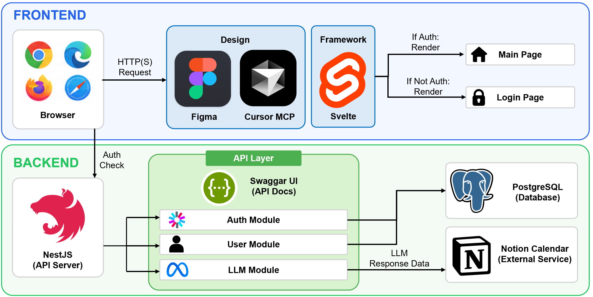

https://github.com/user-attachments/assets/51441379-0184-4c44-b2c1-d08a0d144525

    

**AutoPlanner**는 LLM이 사용자 맞춤 학습 계획을 자동으로 생성하고 Notion Calendar에 연동해주는 서비스입니다.

#### 주요 기능
1. 회원가입 후 집중형/분산형, 학습 요일 등 공부 성향 설정
2. 과목명, 마감일, 챕터별 난이도와 분량을 입력하면 LLM이 날짜별 학습 계획 자동 생성
3. 생성된 계획을 버튼 하나로 Notion Calendar에 동기화

## 시스템 아키텍처


## 설치 및 실행
### Frontend
```bash
cd advanced-programming/frontend/idh

npm install
npm run dev
```

### Backend
```bash
git clone [repository-url]
cd advanced-programming/auto-planner-backend

npm install

cp .env.example .env
# .env 파일에서 DATABASE_URL, JWT_SECRET, LLAMA_API_KEY, NOTION_API_KEY 설정

npx prisma migrate dev
npm run start:dev
```

자세한 구조는 [function-document.md](function-document.md)를 참고하세요.
