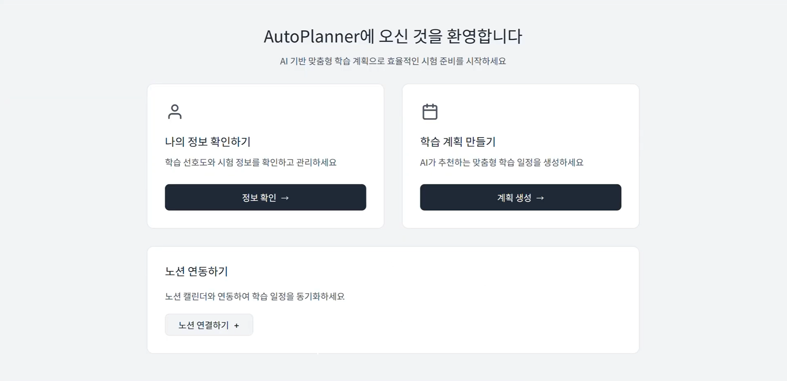

# 🗓️ AutoPlanner

    



## 프로젝트 소개

계획 세우는 데 시간을 낭비하지 마세요.

AutoPlanner는 공부 성향과 시험 정보를 분석해 LLM이 최적의 학습 계획을 생성하고, Notion Calendar에 자동으로 연동해주는 서비스입니다.

## 시연 영상

https://github.com/user-attachments/assets/51441379-0184-4c44-b2c1-d08a0d144525

## 주요 기능

**사용자 관리**
회원가입 및 로그인을 지원하며, 집중형/분산형 여부, 학습 요일 등 개인 공부 성향을 프로필로 설정할 수 있습니다.

**학습 계획 생성**
과목명, 마감일, 중요도와 챕터별 난이도 및 분량을 입력하면 LLM이 날짜별 최적 학습 계획을 자동으로 생성합니다.

**Notion 연동**
생성된 계획을 버튼 하나로 Notion Calendar에 동기화합니다.

## 설치 및 실행

### Backend
```bash
git clone [repository-url]
cd advanced-programming/auto-planner-backend

npm install

cp .env.example .env
# .env 파일에서 DATABASE_URL, JWT_SECRET, LLAMA_API_KEY, NOTION_API_KEY 설정

npx prisma migrate dev
npm run start:dev
\```

### Frontend
\```bash
cd advanced-programming/frontend/idh

npm install
npm run dev
\```
